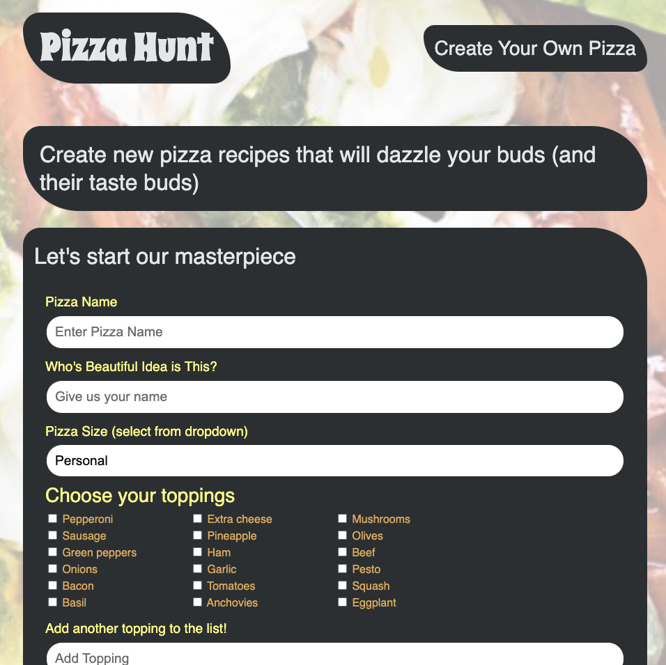

# Pizza Hunt

## Overview

Pizza Hunt—a self-aware riff on social-media applications that already exist for other topics—lets users connect with each other based on their love of pizza. In Pizza Hunt, users can share and discuss their dream pizza-topping combinations. Pizza is ubiquitous in everyday life all over the world, and no application has ever been created with the sole purpose of facilitating discussions about it. The client hopes to be the first to market with it, and they need your help.

## Installation

To install this application, clone the code into your terminal for the respective repository. Then, install npm by entering the command npm install into the terminal. Install express and mongoose by entering npm i express and npm i mongoose into the command line, respectively.

## Tech used:

• Node • Express • HTML 5 • CSS • Javascript • Handlebars.js • Mongoose • MongoDB • Mongoose • Heroku
